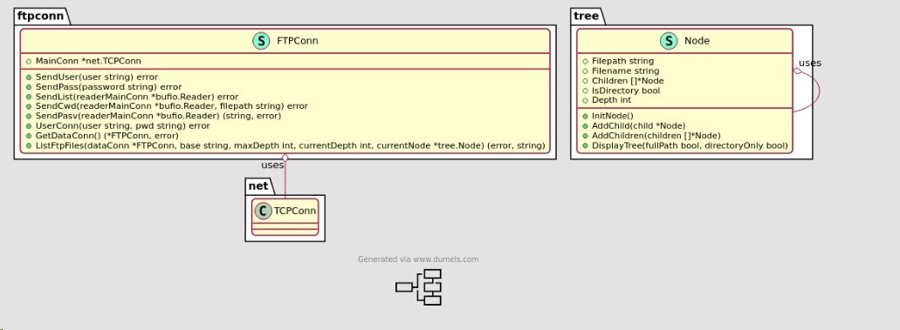

# Client FTP
**Auteur** : Aurélien Plancke M1 E-Services

Ce programme tree-FTP à été réalisé en GO dans le cadre des cours de Système Répartis en Master 1 E-Services.
Il a pour but de se comporter en tant que client FTP et se connecter à un serveur, afin d'en afficher le contenu, sous 
une forme semblable au résultat que produit la commande linux tree.

## Installation

### Prérequis
Afin d'executer ce programme, il faut tout d'abord installer [le langage Go](https://go.dev/doc/install)

Une fois cette étape effectuée, il suffit de se rendre à la racine de ce dépôt et d'exécuter la commande 
``
go build
``

L'executable sera ainsi créé sous le nom de tree-ftp. Afin de l'utiliser il suffit de tapper ``./tree-ftp``

## Fonctionnement de la CLI
Ce programme étant en Command LIne, il y a de nombreux paramètres pouvant être précisés.

Tout d'abord les paramètres de bases obligatoires sont --addressServer et --port, afin de les utiliser, il suffit de taper 

``./tree-ftp --addressServer="l'adresse_du_serveur" --port="port_du_serveur"``

Le port par défaut est le 21 pour le
protocole FTP, mais la possibilité est laissée à l'utilisateur de le préciser. Par défaut, si le port n'est pas précisé,
la valeur 21 sera donc prise.

Dans le cas d'une connexion qui requiert une authentification, il est possible de préciser les flags ``--user`` et ``
--password``.
Si l'un des deux est précisé, l'autre est obligatoire. Sans les préciser, les valeurs "anonymous" seront utilisées pour
l'user et le mot de passe.

L'option ``--maxDepth`` peut être précisé afin d'arrêter le listing à une profondeur de l'arborescence du serveur. Par défaut ou 
si celle-ci n'est pas précisée, tree-ftp parcoureras toute l'arborescence.

L'option ``--directoryOnly`` sert à afficher uniquement les repertoires lors du tree. Elle prends un booléen en paramètre,
par défaut celui-ci est à false.

L'option ``--fullPath`` sert à afficher les chemins complets des fichiers lors du tree. Elle prends un booléen en paramètre,
par défaut celui-ci est à false.

### Exemple d'utilisation

``./tree-ftp --addressServer="l'adresse_du_serveur"``

``./tree-ftp --addressServer="l'adresse_du_serveur" --user="USERNAME" --password="PASSWORD"``

``./tree-ftp --addressServer="l'adresse_du_serveur" --maxDepth="3"``

``./tree-ftp --addressServer="l'adresse_du_serveur" --directoryOnly="True"``

``./tree-ftp --addressServer="l'adresse_du_serveur" --fullPath="True"``

``./tree-ftp --addressServer="l'adresse_du_serveur" --directoryOnly="True"  --fullPath="True" --maxDepth="3"``


## Fonctionnement du programme
Le programme à une logique simple. Dans un premier temps nous allons établir une connexion avec l'url fournie lors du lancement
de la CLI. Le protocole FTP fonctionne de tel manière qu'il y a une connexion pour les commandes et leur retour, et une pour les données.
Cette seconde connexion et ses informations est établi grâce aux informations renvoyées par la commande ``PASV`` sur la 
connexion principale. Une fois cette seconde connexion établie, nous allons envoyé la commande ``LIST``sur le canal principal
et nous aurons le retour sur la connexion de données. Cette commande nous renvoyant une liste des fichiers à la position
actuelle, il ne nous reste plus qu'à changer de dossier courant pour chaque dossier trouvé avec la commande ``CWD``. Une
nouvelle connexion avec ``PASV`` est necessaire à chaque ``CWD``. 

## Architecture

La base du programme est dans **cmd/root.go**, grâce a la bibliothèque [Cobra](https://github.com/spf13/cobra), c'est à cet
endroit que sont definies les options attendues, qu'elles sont parsées et que leur valeur recupérées. Grâce à cela nous 
pouvons établir la connexion TCP qui nous servira à communiquer avec le serveur FTP. Ensuite tout ce passe dans le package
**ftpconn**.
Ce package concerne toute les interactions serveur, ce qui permet de séparer les responsabilités.

L'architecture logiciel est plus compliquée en Go, ce langage n'étant pas un langage orienté objet, cependant l'utilisation des 
[pointer receivers](https://go.dev/tour/methods/4) est d'une grande aide. Par exemple, dans le cadre du type Node, qui
représente un arbre de données pour l'arborescence des fichiers, des méthodes ont pu être établie sur ce type particulier. 
Cela permet de facilement ajouter des fonctionnalités dans le type node si necessaire, sans avoir à faire trop de refactoring. 

Le package **ftpconn** est donc divisé en deux fichier _ftpconn_ et _ftpCommand_. Le premier definit un type qui encapsule le type net.TCPConn.
En procédant ainsi, nous pouvons ainsi d'étendre le type net.TCPConn, en y ajoutant des méthodes, tout en gardant l'accès
à celle de la socket tcp.
FtpCommand quand à lui concerne la couche qui interagit directement avec le serveur, avec les envois et traitement des résultats
des commandes FTP.


## Commandes implémentées

| Commande FTP |                               Effet                                |                      Prends en paramètres                       | Retry |
|:------------:|:------------------------------------------------------------------:|:---------------------------------------------------------------:|:-----:|
|     USER     |                 Commence la procédure de connexion                 |                      Le nom d'utilisateur                       |   3   |
|     PASS     |                 Permet de vérifier le mot de passe                 |                Le mot de passe de l'utilisateur                 |   3   |
|     PASV     | Permet de demander une ip et un port pour une connexion de données |              Le reader de la connexion principale               |   3   |
|     LIST     |               Liste les fichiers du dossier courant                |              Le reader de la connexion principale               |   3   |
|     CWD      |                    Change le repertoire courant                    |              Le reader de la connexion principale               |   3   |

## Code samples

La fonction qui va être présentée ici est celle qui permet de faire la première connexion, avec le mot de passe et le nom
d'utilisateur s'ils sont fournis.

```go 
// UserConn Init TCP conn with given user and pwd, if both are not precised, anonymous is the default/**
func (conn *FTPConn) UserConn(user string, pwd string) error {
    fmt.Println("User connexion")
    err := conn.SendUser(user) //send the user cmd with user
    if err != nil {
        return err
    }

    err = conn.SendPass(pwd) // send the pass cmd with pass
    if err != nil {
        return err
    }

    reply := make([]byte, constant.SizeAnswer)
    _, err = conn.MainConn.Read(reply) // read result from mainConn

    if err != nil || !strings.Contains(string(reply), constantFTP.CodeLoginOk) { 
        if strings.Contains(string(reply), constantFTP.CodeLoginNotOk) { //if login not ok
            if retryLogin == constant.MaxRetry { //retry 3 times
                log.Fatalf("too many retry for login/password ")
            }
            fmt.Println("Wrong password/login !")
            fmt.Println("Enter your login")
            reader := bufio.NewReader(os.Stdin)
            login, _ := reader.ReadString('\n')
            login = strings.Replace(login, "\n", "", -1)
            fmt.Println("Enter your password")
            password, _ := reader.ReadString('\n')
            password = strings.Replace(password, "\n", "", -1)
            retryLogin++
            return conn.UserConn(login, password) //retry

        }
        return err //error either from read or too many fail
    }
    fmt.Println("User connexion successful")
    return nil // no error
}
```

La fonction suivante permet de trouver l'ip à partir d'une addresse fournie.
```go
// GetIpFromURL return the found IP for the given addressServer and port
func GetIpFromURL(port int, addressServer string) (*net.TCPAddr, error) {
    ip, err := net.LookupIP(addressServer) //Use the local resolver to return IPs for the given address
    if err != nil {
        return nil, err
    }
    fmt.Printf("IP adress found for %s : %s\n", addressServer, ip[0].String())

	addr := &net.TCPAddr{ //create the IP "object" with the first one found
		IP:   ip[0],
		Port: port,
	}
	return addr, nil
}
```

La fonction SendList est celle qui interagit directement avec le serveur FTP, celle ci propose une gestion d'erreur plus poussée
```go
// SendList send ftp List command and control the result with readerMainConn
func (conn *FTPConn) SendList(readerMainConn *bufio.Reader) error {
	stringToSend := commandFTPConstant.List + "\n" //construct query to send (LIST\n)
	var err error = nil
	for i := 0; i < constant.MaxRetry; i++ { // 3 retry
		_, err := conn.MainConn.Write([]byte(stringToSend)) //write on socket the request
		if err != nil {
			if errors.Is(err, syscall.EPIPE) { // if we got syscall.EPIPE error, the connection is broken no need to retry
				return err
			}
			fmt.Printf("Err SendList %s, retrying in 10s\n", err.Error()) 
			time.Sleep(constant.TimeBeforeRetry * time.Second) // wait 10 seconds
			continue // jump to next iteration
		}
		line, _, err := readerMainConn.ReadLine() //read result from control connection
		if err != nil || !strings.Contains(string(line), constantFTP.CodeOkList) { //if we got an error or the result is not as it should be
			var stringToPrint = ""
			if err != nil { // necessary to avoid nil pointer in case it's the result that's not ok
				stringToPrint = fmt.Sprintf("Err SendList %s, retrying in 10s\n", err.Error())
			} else {
				stringToPrint = fmt.Sprintf("Wrong code response : %s\n", string(line))
			}
			fmt.Printf(stringToPrint)
			time.Sleep(constant.TimeBeforeRetry * time.Second) // wait 10s
			continue //jump to next iteration
		} else {
			break //no error, we can exit the loop
		}
	}
	if err != nil { //still have to check if we left the loop before or after all retry
		fmt.Printf("CWD failed 3 times, aborting")
		return err
	}

	return nil //everything is ok
}
```

L'etablissement de la connexion est faite grâce à la fonction suivante, la gestion des erreurs n'est ici pas montrée mais
bien presente dans la fonction complète.

```go
// GetDataConn Create a new data connection from mainConn, that send PASV/**
func (conn *FTPConn) GetDataConn() (*FTPConn, error) {
	readerMainConn := bufio.NewReader(conn.MainConn) //Create reader from control connection 
	line, err := conn.SendPasv(readerMainConn) // send PASV command and retrieve the result
	err, ipAddrDataConn, portDataConn := getIPAndPortFromResponse(line) //parse the result to extract ip and port
	ip := &net.TCPAddr{ //instanciate the IP object
		IP:   net.ParseIP(ipAddrDataConn),
		Port: portDataConn,
	}
	connData, err := net.DialTCP(constant.TcpString, nil, ip) //create the tcp socket
	return &FTPConn{MainConn: connData}, nil //encapsulate the tcp socket in FTPConn type
}
```

## Gestion des erreurs

Une mécanique de retry est mise en place dans ce programme. En effet chaque opération avec le serveur est répétée jusqu'à 3 fois.
C'est un mécanisme important car il peut y avoir une micro coupure avec le connexion distante, et si celle-ci tombe au mauvais 
moment, cela provoquerait un arrêt total du programme. 

Afin de faciliter la gestion des erreurs et comme il est de bonne pratique de le faire en go, toutes les erreurs possibles sont remontées
jusqu'a **root.go**. Si celle-ci necessitent un arrêt du programme, c'est à cet endroit que cela sera fait. En utilisant cette
méthode de programmation, il serait possible dans une évolution du programme d'implementer un retry sur tout un pan de celui-ci,
en cas d'erreur grave.

En plus des erreurs liés à l'execution des fonctions, tel l'I/O, un nombre important de code d'erreur pouvant être renvoyés par
une commande FTP est géré. 

## UML



## Vidéo de fonctionnement